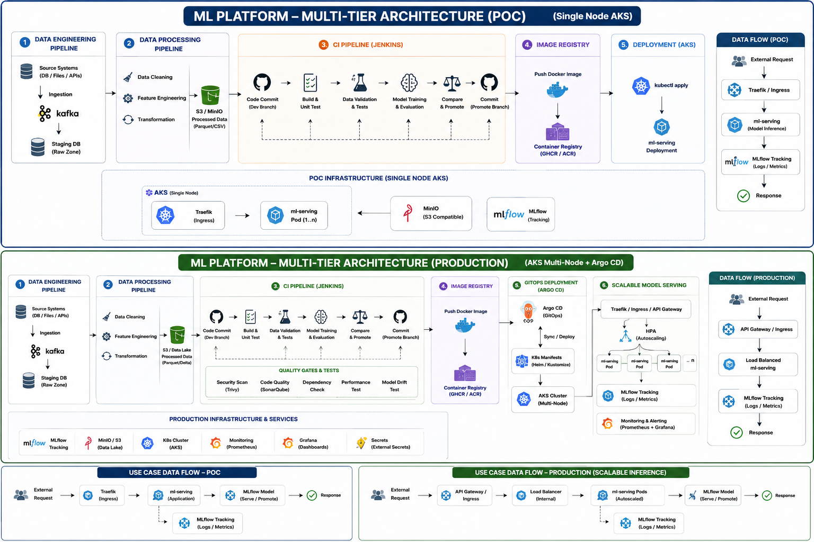
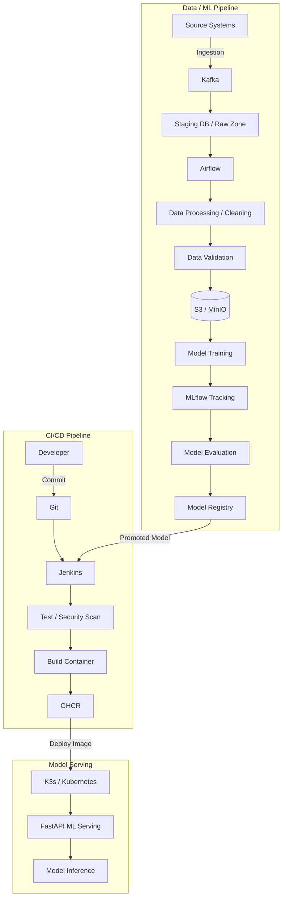

# ML Platform: Multi-Tier Architecture Analysis & Repository Guide

This document provides a comprehensive analysis of the transition from a **Proof-of-Concept (POC)** Machine Learning platform to a resilient, enterprise-grade **Production Architecture**. It includes detailed workflow breakdowns and a production-ready `README.md` containing a fully unified Mermaid diagram script.

---

## Executive Summary

Scaling machine learning systems requires moving away from static notebooks and manual deployments toward automated pipelines, robust quality gates, GitOps workflows, and horizontal autoscaling. 

The architecture diagram analyzed contrasts two operational tiers:
1. **POC Architecture (Single-Node AKS):** Designed for agility, rapid model iteration, and lightweight validation.
2. **Production Architecture (Multi-Node AKS + Argo CD):** Designed for high availability, automated security scanning, continuous delivery, and dynamic load handling.

---

## Comparative Architectural Breakdown

| Dimension | Proof-of-Concept (POC) | Production Architecture |
| :--- | :--- | :--- |
| **Infrastructure** | Single-node Azure Kubernetes Service (AKS) | Multi-node AKS cluster with dedicated worker nodes |
| **Data & Storage** | Local or single-instance MinIO (S3-compatible) | Scalable Enterprise Data Lake (Parquet / Delta Lake) |
| **CI/CD & Testing** | Standard build, unit tests, training, and registry push | Jenkins + rigorous **Quality Gates** (Trivy, SonarQube, Dependency & Performance checks, Model Drift tests) |
| **Deployment Method** | Manual or scripted `kubectl apply` | Declarative **GitOps Deployment** via Argo CD using Helm/Kustomize |
| **Model Serving** | Static single pod deployment (`ml-serving`) | Horizontal Pod Autoscaler (HPA) with multi-pod load balancing |
| **Observability** | Basic MLflow tracking (Logs & Metrics) | MLflow + Prometheus & Grafana for advanced monitoring and alerting |

# Enterprise ML Platform Architecture

This repository defines the multi-tier architecture patterns for scaling Machine Learning workloads from a Single-Node Proof-of-Concept (POC) to a fully automated, resilient Production environment.

<p align="center">
  
</p>

<p align="center">
  <b>Production ML Serving Architecture</b>
</p>


---

## 1. Proof-of-Concept (POC) Architecture

The POC setup is optimized for rapid experimentation, validation, and single-node deployment using lightweight components.



# 🚀 How to Run the ML Serving Project

Follow these steps to run the complete ML serving project locally with Kubernetes/K3s.

## 1. Clone the Repository

```bash
git clone <YOUR_REPOSITORY_URL>
cd <PROJECT_DIRECTORY>
```

## 2. Start Required Services

Make sure the required services are running:

* K3s / Kubernetes
* MLflow
* MinIO, if required by the model setup
* Jenkins
* git and GHCR need to be configure

Check K3s:

```bash
sudo systemctl status k3s
```

Check the cluster:

```bash
kubectl get nodes
```

Expected:

```text
STATUS: Ready
```

---


## 3. Create the Kubernetes Namespace

```bash
kubectl create namespace ml-serving
```

If it already exists:

```bash
kubectl get namespace ml-serving
```

---

## 4. Configure GHCR Authentication

Create the registry secret:

```bash
kubectl create secret docker-registry ghcr-secret \
  --docker-server=ghcr.io \
  --docker-username=<GITHUB_USERNAME> \
  --docker-password='<GITHUB_TOKEN>' \
  -n ml-serving
```

Verify:

```bash
kubectl get secret -n ml-serving
```

---

## 5. Deploy the Application

First validate the Kubernetes YAML:

```bash
kubectl apply --dry-run=client -f model-deployment.yaml
```

Deploy:

```bash
kubectl apply -f model-deployment.yaml (chnage venv and image: ghcr.io/mainak23/ml-serving:version)
```

---

## 6. Check the Deployment

```bash
kubectl get deployment -n ml-serving
```

```bash
kubectl get pods -n ml-serving
```

The expected state is:

```text
1/1 Running
```

Check rollout:

```bash
kubectl rollout status deployment/ml-serving2 -n ml-serving
```

---

## 7. Check Application Logs

```bash
kubectl logs deployment/ml-serving2 \
  -n ml-serving \
  --tail=100
```

For live logs:

```bash
kubectl logs deployment/ml-serving2 \
  -n ml-serving \
  -f
```

---

## 8. Port Forward the API

Forward the Kubernetes service to your local machine:

```bash
kubectl port-forward svc/ml-serving2 8081:8080 -n ml-serving
```

Keep this terminal running.

---

## 9. Test the Health Endpoint

Open another terminal:

```bash
curl http://127.0.0.1:8081/health
```

Expected:

```json
{"status":"healthy"}
```

---

## 10. Test the Prediction API

Send 30 breast-cancer features:

```bash
curl -X POST http://127.0.0.1:8081/predict \
-H "Content-Type: application/json" \
-d '{
  "data": [[17.99,10.38,122.8,1001.0,0.1184,0.2776,0.3001,0.1471,0.2419,0.07871,1.095,0.9053,8.589,153.4,0.006399,0.04904,0.05373,0.01587,0.03003,0.006193,25.38,17.33,184.6,2019.0,0.1622,0.6656,0.7119,0.2654,0.4601,0.1189]]
}'
```

Expected:

```json
{"prediction":[0]}
```

---

# ✅ Final Verification Checklist

* [ ] Repository cloned
* [ ] K3s running
* [ ] Kubernetes node is `Ready`
* [ ] MLflow is accessible
* [ ] Container image built
* [ ] Image pushed to GHCR
* [ ] GHCR secret created
* [ ] Kubernetes YAML validated
* [ ] Deployment created
* [ ] Pod is `1/1 Running`
* [ ] Application logs checked
* [ ] Port forwarding enabled
* [ ] `/health` returns `healthy`
* [ ] `/predict` returns a prediction

